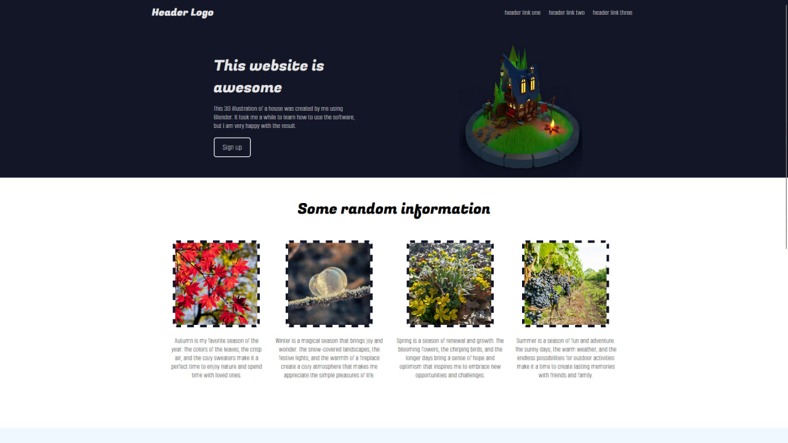
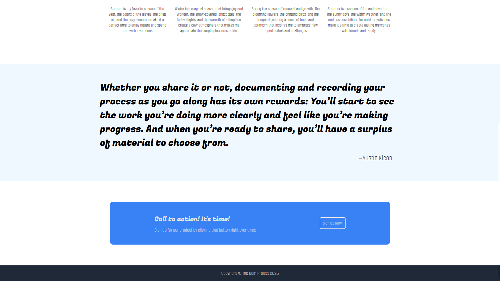

# Landing Page

In this project I styled simple webpage without any interaction. Maybe later I will extend it and change its contents but right now it is simply a nice looking page at 27 inch monitor.

Skills demonstrated: 
 - HTML placement
 - Basic CSS Flexbox skills
 - Usage of Google Fonts and color picker utilities
 - Searching for free to use images in internet
 - Well structured CSS document
 
Below is how this page looks on my monitor:

